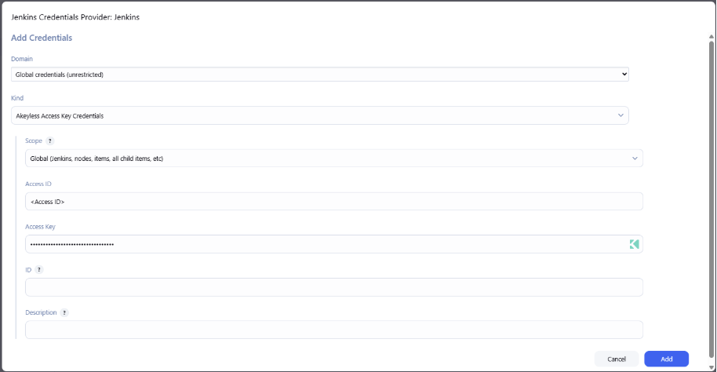
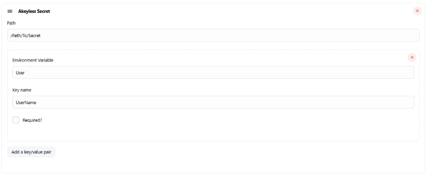
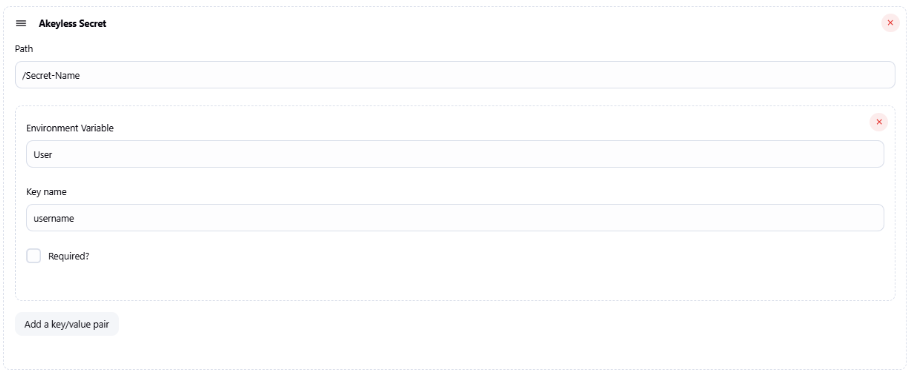
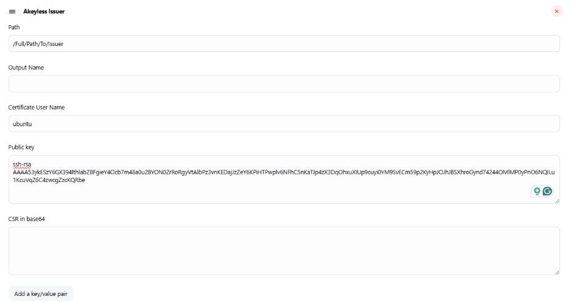
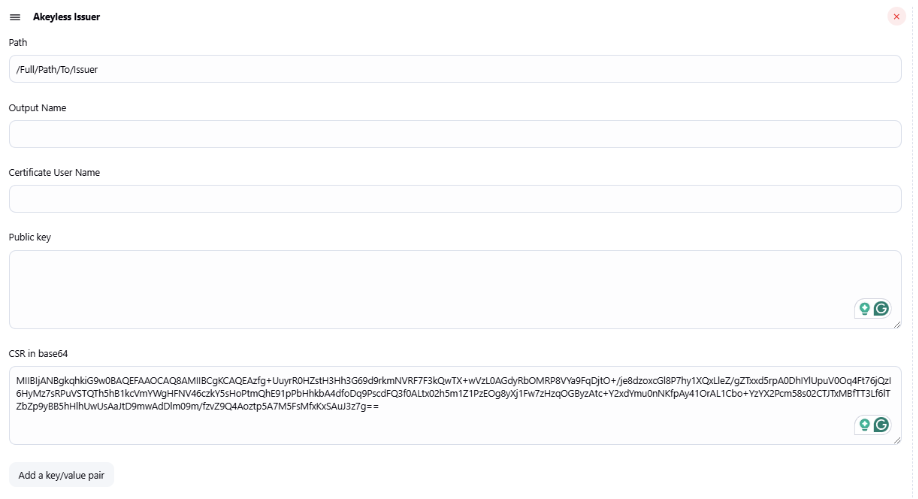

# Akeyless Plugin for Jenkins

## Introduction
The **Akeyless Plugin for Jenkins** enables secure integration of Akeyless-managed secrets and certificates within Jenkins pipelines. It supports multiple authentication methods, ensuring seamless and secure access to secrets and certificates.

Additionally, JSON-structured secrets can be retrieved by specifying specific keys, allowing precise control over the data fetched from Akeyless.

## Table of Contents
- [Installation](#Installation)
  
- [Supported Authentication Methods](#supported-authentication-methods)
  
- [Configuration](#configuration)
  
- [Retrieving Items](#Retrieving-Items)
  
  - [Fetching Secrets](#fetching-secrets)
    
  - [Fetching Certificates](#fetching-certificates)
    
- [Examples](#examples)
  
  - [Configuring API Key Authentication](#setting-api-key-authentication)
    
  - [Fetching a Static Secret](#fetching-a-static-secret)
    
  - [Fetching a Rotated Secret](#fetching-a-rotated-secret-with-specific-keys)
    
  - [Issuing an SSH Certificate](#issuing-an-ssh-certificate)
    
  - [Issuing a PKI Certificate](#issuing-a-pki-certificate)

---

## Installation

Run the following steps to install the Akeyless plugin for Jenkins:

1. Navigate to **Manage Jenkins** → **Plugins**.
   
2. Go to **Available Plugins** and search for **Akeyless**.
   
3. Check the plugin and press **Install**

## Supported Authentication Methods
The plugin supports the following authentication methods:

- [API Key](https://docs.akeyless.io/docs/api-key)
  
- [AWS IAM](https://docs.akeyless.io/docs/aws-iam)
  
- [Azure AD](https://docs.akeyless.io/docs/azure-ad)

- [Certificate](https://docs.akeyless.io/docs/certificate-based-authentication)
  
- [Google Cloud Platform (GCP)](https://docs.akeyless.io/docs/gcp-auth-method)
  
- [Kubernetes](https://docs.akeyless.io/docs/kubernetes-auth)
  
- [Universal Identity](https://docs.akeyless.io/docs/universal-identity)
  
- [Email](https://docs.akeyless.io/docs/email)

## Configuration
To configure the Akeyless plugin in Jenkins:

1. From the **Jenkins Dashboard**, press **New Item**, choose **Freestyle Project**, give it a name and press **ok**.
   
2. Scroll down to **Environment** and check **Akeyless Plugin**
   
3. Set the **Akeyless URL** to your gateway URL, with the `/api/v2` endpoint.
   
4. Add a new **Access Mode**:
   
   - Under **Vault Credential**, press **Add** > **Jenkins**.
     
   - Choose the Authentication Method from the **Kind** drop-down:
     
       * **Username with password** - **Email** Authentication Method.
         
       * **Akeyless Access Key Credentials** - **API Key** Authentication Method.
         
       * **Akeyless Certificate Credentials** - **Certificate** Authentication Method.
         
       * **Akeyless Cloud Provider Credentials** - **AWS, Azure or GCP** Authentication Method.
         
       * **Akeyless Universal Identity Credentials** - **Universal Identity** Authentication Method.
         
       * **Akeyless t-Token Credentials** - **t-Token**.
         
     
   - Click **Add** to save the configuration.

## Retrieving Items
The Akeyless plugin allows you to retrieve **Static**, **Dynamic**, and **Rotated** secrets and **PKI** and **SSH** certificates.

### Retrieving Secrets
To retrieve a secret:

1. Click **Add Akeyless Secret**.
   
2. Configure the following parameters:
   
   - **Path**: Enter the full path of the secret.
     
   - **Environment Variable**: Define an environment variable to store the secret's value.
     
   - **Key Name** (for JSON-type secrets): Specify the key to fetch. To retrieve all keys, enter `data`.

### Issuing Certificates
To Issue a certificate:

1. Click **Add Akeyless Issuer**.
   
2. Configure the following parameters:
   
   - **Path**: Enter the full path of the certificate issuer.
     
   - **Output Name**: Name the retrieved certificate.
     
   - **Certificate User Name**: (For SSH certificates) Enter the username to be signed.
     
   - **Public Key**: Provide the public key (if required).
     
   - **CSR in base64**: Provide the Certificate Signing Request (CSR) in base64 format.
     
   - **Environment Variable**: Define an environment variable to store the certificate.
     
   - **Key Name**: Specify the key to fetch. To retrieve all keys, enter `data`.

## Examples
The following examples demonstrate how to authenticate and retrieve items using the Akeyless Plugin for Jenkins.

### Setting API Key Authentication

* The following configuration utilizes an existing API key in Akeyless for Jenkins authentication.
  

### Fetching a Static Secret

* The following configuration will fetch a static secret to your pipeline.
  This example uses a JSON-Structured secret, where only the **UserName** key of the secret is saved to **User** Environment Variable.

  
### Fetching a Rotated Secret with specific Keys:
* The following example will only fetch the **username** of the rotated secret value, and will store it into **User** environment variable:
  

### Issuing an SSH Certificate
* The following above will generate an **SSH Certificate** that will be allowed for **ubuntu** user, using a public key:
  

 
### Issuing a PKI Certificate
* The following example will generate **PKI Certificate** using predefind **Certificate Signing Request**:
  

 
---

## License
This project is licensed under the MIT License. See the [LICENSE](LICENSE) file for details.

## Contributing
We welcome contributions! Feel free to submit issues and pull requests.

## Support
For any issues or questions, please visit our [Akeyless Documentation](https://docs.akeyless.io/) or open an issue on this repository.

